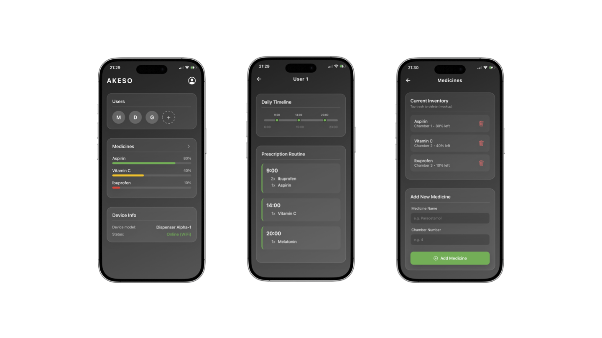
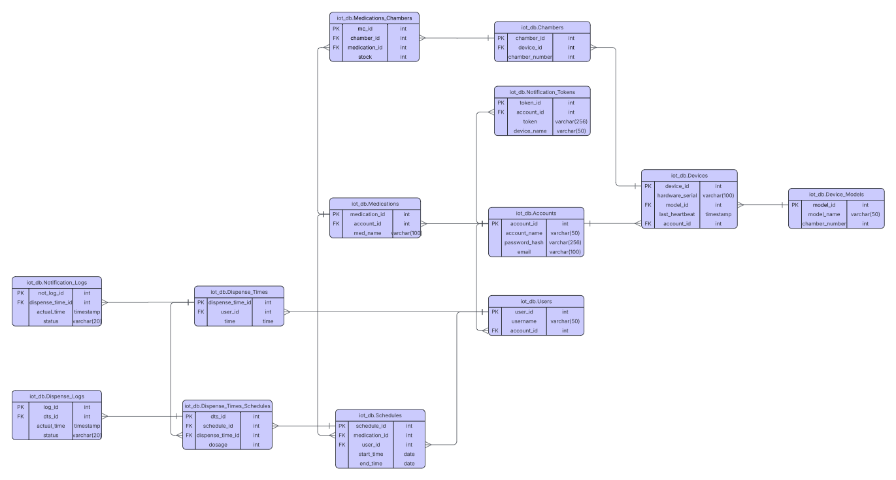

# Smart Pill Dispenser

## 1. Introduction

This repository contains the backend, database, and mobile frontend application for the Smart Pill Dispenser project. The system is designed to manage users, their medication schedules, and the physical dispensing device.

The hardware part for the Smart Pill Dispenser project can be found in this
[repo](https://github.com/Kamil-Troszczynski/SmartPillDispenser)

## 2. App

The mobile application (AKESO) provides a comprehensive interface for managing the smart pill dispenser. Its key functionalities include:



- **Dashboard:** Displays multiple users, an overview of current medication inventory levels across different chambers and real-time device status and model information.
- **User Timelines & Routines:** Allows viewing a specific user's daily timeline and prescription routine, indicating exactly which medications and dosages need to be taken at specific times.
- **Inventory Management:** Provides a detailed view of current medication stock per chamber, and allows users to easily add new medicines to specific chambers or delete existing ones.

## 3. Backend

The backend is built to handle API requests from the mobile app and communicate with the physical dispenser device using the MQTT protocol.

### MQTT Communication
The backend communicates with the physical dispensers asynchronously via an MQTT broker using JSON payloads:
- **Synchronization (`pill_dispenser/<device_id>/sync`):** The backend publishes schedule updates with Quality of Service (QoS 1) and Retained flags. This payload includes user details, assigned chambers, and specific dispense events (times and dosages). Retaining the message ensures that devices receive the latest schedules immediately upon reconnecting.
- **Confirmations (`pill_dispenser/+/pub_confirmation`):** The backend subscribes to these topics to listen for successful dispense events from the devices. When a device confirms a medication was taken, the backend parses the `dts_id` and records the event in the database logs.

### Database
The system uses a PostgreSQL database with a structured relational model to manage all data.



Key entities include:
- **Accounts & Users:** For managing multi-user access under a single account.
- **Devices & Chambers:** Tracks the physical dispenser units, their models, and the individual chambers holding the medication.
- **Medications & Stock:** Maps medications to specific chambers and monitors current stock levels.
- **Schedules & Dispense Times:** Defines the medication routines (start/end dates) and exact dispensing times for users.
- **Logs:** Keeps track of actual dispense events (`Dispense_Logs`) and notifications sent (`Notification_Logs`).

## 4. How to run

### Prerequisites

Before you begin, ensure you have the following installed on your machine:
- **[Docker](https://www.docker.com/products/docker-desktop/)** and **Docker Compose** (for running the backend and database)
- **[Node.js](https://nodejs.org/en) (v18+)** and **npm** (for running the mobile app)
- **[Expo Go](https://expo.dev/expo-go)** app installed on your physical mobile device, or a mobile emulator (iOS Simulator / Android Studio) setup on your computer.

---

### Running the Backend and Database

The backend API and the PostgreSQL database are containerized using Docker.

To start them:

1. Open a terminal.
2. Navigate to the `infra` directory of the project:
   ```bash
   cd infra
   ```
3. Start the services using Docker Compose:
   ```bash
   docker compose up --build
   ```

This will build the backend image, start the database, and run the backend API.
- The Backend API will be accessible at: `http://localhost:8000`
- The Database will be exposed on port `5432`.

---

### Running the Mobile App (Frontend)

The frontend is a React Native mobile application built with Expo.

To run the mobile app:

1. Open a new terminal window.
2. Navigate to the `frontend` directory:
   ```bash
   cd frontend
   ```
3. Install the required Node.js dependencies:
   ```bash
   npm install
   ```
4. Start the Expo development server:
   ```bash
   npx expo start
   ```

A QR code will appear in your terminal.
- **Physical Device:** Scan the QR code using the Expo Go app.
- **Emulator:** Press `i` to open it in the iOS Simulator, or `a` to open it in the Android Emulator.

> **Note on connecting to the Local Backend:**
> If you are running the app on a physical device, navigating to `frontend/app/index.tsx` and changing the `127.0.0.1` inside the `fetch()` call to your computer's local network IP address (e.g., `192.168.1.50`) is required. Emulators will generally work fine with `127.0.0.1` (iOS) or `10.0.2.2` (Android).

---

### Get into db
```bash
docker exec -it postgres_db psql -U admin -d pill_dispenser_db
```

### Running functional and performance tests
Now, tests can be launched with commands
```bash
cd backend/tests
docker exec -it python_backend python -m pytest tests/
```
